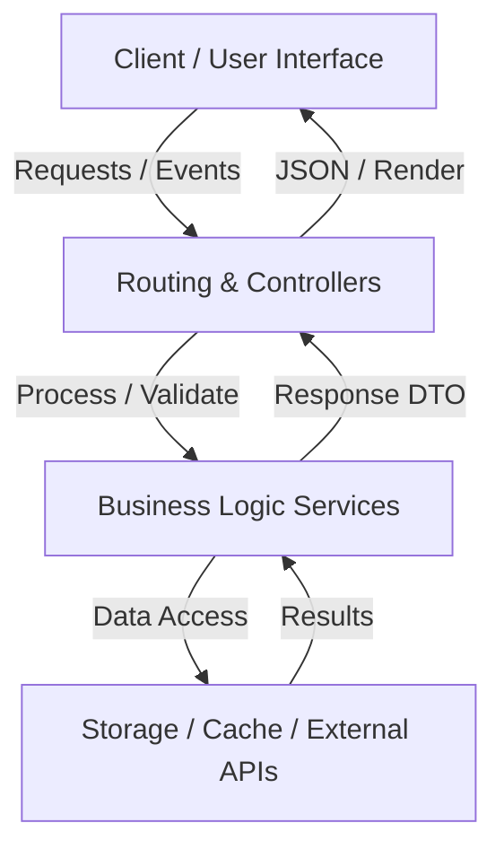

# Data Flow Architecture: AI-Dev-Team

## Lifecycle Flow
1. **Input**: User interactions, HTTP API requests, or CLI execution.
2. **Validation**: Boundary checking, schema validation, rate-limiting, and sanitized payloads.
3. **Processing**: Domain services execute atomic operations.
4. **Output**: Structured responses, reactive UI re-renders, and atomic persistence.
